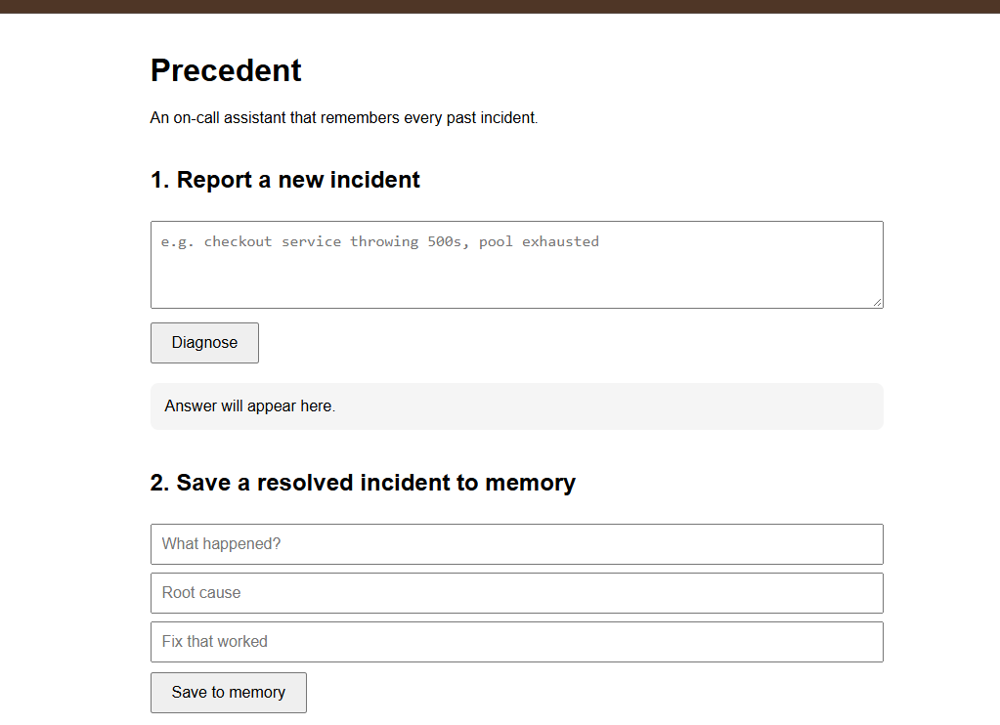
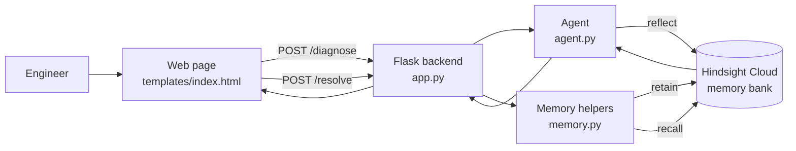

# Precedent

**An on-call assistant that remembers every past production incident, so the same outage never gets diagnosed from scratch twice.**

Precedent is a small web app. You describe a new incident ("redis timeouts again during a traffic spike") and it searches its long-term memory, powered by [Hindsight](https://github.com/vectorize-io/hindsight), for similar past incidents. It answers with the root cause and the fix that worked last time. If it has never seen anything like it, it says so instead of guessing.

> Built by: **Maddela Aashritha** and **Nukala Sai Chetan**
> Demo video: **[ADD YOUTUBE LINK]**

<!-- Add a screenshot of the app here:

-->

---

## The problem

When production breaks, engineers scramble to find the cause. Often something very similar has broken before, but the answer lives in an old Slack thread, a forgotten doc, or one person's head. Teams lose time re-diagnosing problems they have already solved.

A generic chatbot doesn't help much here. It gives textbook advice and knows nothing about *your* systems or *your* history.

## What Precedent does

1. **Report a new incident** in plain language.
2. Precedent searches its memory and answers with the previous root cause and fix, with dates.
3. If related incidents exist, it points out the pattern (for example, several configuration-change failures).
4. If the incident is new, it says so clearly.
5. **After you fix an incident**, you save it through a form, and Precedent remembers it for next time.

Each saved incident makes the next diagnosis better. That is the whole idea.

---

## How Hindsight memory is used

Memory is the core of this project, not an add-on. Hindsight is a memory layer for AI agents with three operations, and Precedent uses all three.

| Operation | Where it is used | What it does here |
|---|---|---|
| **Retain** | `memory.py` → `store_incident()` | Saves each resolved incident (what happened, root cause, fix). Hindsight extracts the individual facts, entities and dates from the text. |
| **Recall** | `memory.py` → `recall_similar_incidents()` | Searches memory for facts related to a new incident. Tested in `test_recall.py`. |
| **Reflect** | `agent.py` → `diagnose_with_memory()` | Reasons over the recalled memories and writes the final answer: seen before or not, root cause, fix, and any pattern. |

**What is stored:** incident description, root cause, the fix that worked, and a timestamp.

**When it is stored:** when an engineer saves a resolved incident through the form (or when history is loaded with `seed_incidents.py`).

**How it affects later answers:** the same question gets a different answer depending on what is in memory. Before an incident is saved, the agent says "this is a new type of incident." After it is saved, the agent recognizes it even when the wording is completely different.

**Why it would be worse without memory:** without Hindsight the agent would give the same generic troubleshooting advice every time and could never say "this happened on 2026-09-03, and connection pooling fixed it."

### Before and after

| Question | Without memory (`baseline_agent.py`) | With Hindsight (Precedent) |
|---|---|---|
| "redis timeouts again during a traffic spike" | Generic Redis checklist | Recalls both earlier Redis incidents with dates, root causes and fixes, and notes they are related |
| "customers say they aren't getting our emails" | Generic email delivery checklist | Recalls the expired SMTP API key incident and its fix |
| "disk full on the logging server" (never seen) | Generic advice | States that this is a new type of incident |
| Same disk question after saving it | Same generic advice | Recognizes it even with different wording ("server ran out of disk space and logs stopped writing") |

---

## Architecture



**Flow for a new incident:** web page → Flask `/diagnose` → `agent.py` calls Hindsight `reflect` → Hindsight searches the memory bank and reasons over the results → answer returned to the page.

**Flow for saving an incident:** web page form → Flask `/resolve` → `memory.py` calls Hindsight `retain` → the incident becomes searchable memory.

---

## Project structure

```
precedent/
├── app.py                 # Flask server: /, /diagnose, /resolve
├── agent.py               # Uses Hindsight reflect to answer new incidents
├── memory.py              # retain (store_incident) and recall helpers
├── memory_setup.py        # Hindsight client and memory bank id
├── templates/
│   └── index.html         # Web UI
├── seed_incidents.py      # Loads realistic, dated, synthetic incident history
├── add_fake_incidents.py  # First small set of sample incidents
├── add_incident_2.py      # Example: adding a single incident from a script
├── baseline_agent.py      # Same question to an LLM WITHOUT memory (for comparison)
├── test_connection.py     # Checks the Hindsight connection
├── test_recall.py         # Tests recall on its own
├── requirements.txt
└── README.md
```

---

## Setup

You need Python 3.10 or newer.

### 1. Get your keys

- **Hindsight Cloud:** sign up at <https://ui.hindsight.vectorize.io>, create a memory bank named `precedent-incidents`, then open **Connect** and create an API key.
- **Groq** (only needed for `baseline_agent.py`): create a key at <https://console.groq.com/keys>.

### 2. Install

```bash
git clone https://github.com/maddelaaashritha/precedent.git
cd precedent
python -m venv venv
# Windows:
venv\Scripts\activate
# Mac/Linux:
source venv/bin/activate
pip install -r requirements.txt
```

### 3. Add your keys

Create a file named `.env` in the project folder:

```
HINDSIGHT_API_KEY=your_hindsight_key
HINDSIGHT_BASE_URL=https://api.hindsight.vectorize.io
GROQ_API_KEY=your_groq_key
```

`.env` is listed in `.gitignore` and must never be committed.

### 4. Load the sample history (run once)

```bash
python seed_incidents.py
```

Wait one to two minutes, because Hindsight processes memories in the background.

### 5. Run the app

```bash
python app.py
```

Open <http://127.0.0.1:5000>.

---

## Try it

1. Ask: `redis timeouts again during a traffic spike`. You should see both past Redis incidents.
2. Ask: `customers say they aren't getting our emails`.
3. Ask something new: `search is returning nothing after we reindexed`. Precedent should say it is new.
4. Save it in section 2 of the page (for example: root cause `Elasticsearch index alias was not switched to the new index`, fix `Pointed the alias at the new index and re-ran the health check`).
5. Wait about 20 seconds and ask again with different words: `search is showing zero results since the reindex`.

To see the same question answered **without** memory:

```bash
python baseline_agent.py "redis timeouts again during a traffic spike"
```

---

## Data

The sample incidents are **synthetic**, written to look like realistic production incidents (services such as `checkout-api` and `payment-service`, realistic errors, and dates spread over several weeks). No real company data is used.

## Limitations

- Answers come from Hindsight `reflect`, which reasons over memory, so a response can take 30 to 60 seconds.
- The Flask server runs in single-request mode (`threaded=False`) to avoid a conflict between Flask threads and the Hindsight client's async connections. This is fine for a demo but not for production.
- There is no login or multi-team separation yet. All incidents go into one memory bank.
- Incidents are saved through a simple form. There is no automatic import from PagerDuty, Slack or a ticketing system yet.

## Possible next steps

- Import incidents automatically from alerting and chat tools
- Separate memory banks per team or service
- Suggest runbook steps and track which fixes actually worked
- Add streaming so answers appear as they are generated

---

## Built with

- [Hindsight](https://github.com/vectorize-io/hindsight) for agent memory ([docs](https://hindsight.vectorize.io/), [what is agent memory](https://vectorize.io/what-is-agent-memory))
- Python and Flask
- Groq for the no-memory baseline
